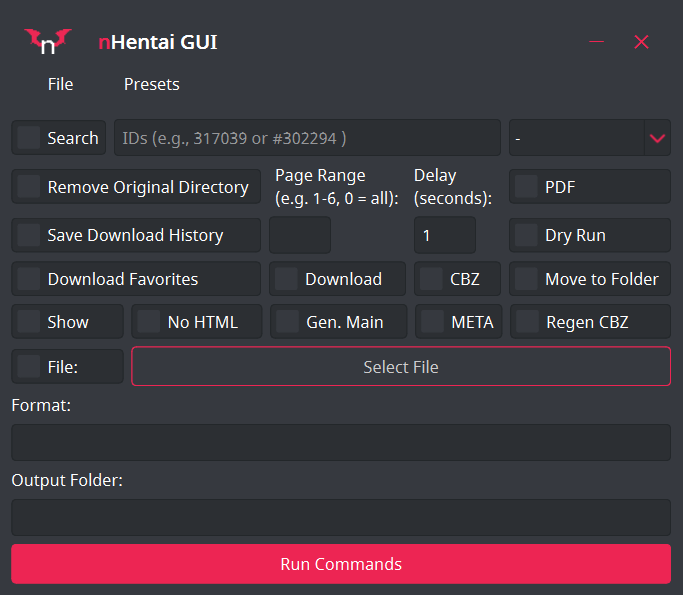

# nHentai GUI

**Please note that nHentai GUI is designed to work alongside RicterZ's [nhentai](https://github.com/RicterZ/nhentai) repository.**

nHentai GUI is a graphical user interface for interacting with RicterZ's nhentai command-line tool. It provides a more user-friendly way to configure and run nhentai commands without needing to use the command line directly.

## Features

- Configure various download options using checkboxes, input fields, and dropdown menus.
- Set default options and presets for easy command configuration.
- Allows for searching and sorting results.
- Select files to download using .txt files.
- Interactive interface for managing cookies and user agents.
- Language selection for content filters.

## Requirements

- Python 3.7+
- PyQt6 library
- RicterZ's nhentai repository
## Optional
- Install my forked version of the [copycookies](https://github.com/edgar1016/copycookies) chrome extension for browser cookie import

## Getting Started

**Running with Python**
1. Download and install RicterZ's nhentai repository from [here](https://github.com/RicterZ/nhentai).
2. Install the required Python packages using pip.
3. Run the `main.py` file from the nhentai repository to start the GUI.

**Running the Windows Executable**
1. Download the latest [release](https://github.com/edgar1016/nhentai-GUI/releases/latest).
2. Extract the zip.
3. Open nhentaiGUI.exe.

_4._ Set a default directory for all your downloads in File -> Options -> Set Default Directory 
or you can just paste the path in the Output Folder input box as needed.

**Note:** When you have a default folder set, any content entered into the Output Folder box will be appended to the end of your default folder path. This is particularly handy for organizing multiple doujins from the same series into specific subfolders within your default folder.

## Using the Cookie Handler

nHentai GUI provides a Cookie Handler that simplifies setting cookies and user agents. You can use the `copycookies` extension to export cookies from your browser and use the Cookie Handler to import them into nHentai GUI.

**Extension:**
1. Open your browser and navigate to the nhentai website and login. 
2. Use the [copycookies](https://github.com/edgar1016/copycookies) extension to export cookies as JSON data by clicking the copy cookie button added to chrome or using the shortcut key `Ctrl+Shift+K`. 
3. In the nHentai GUI, click File -> Options -> Set Cookie
4. Paste the exported JSON data into the "Cookie Extension" field and click "Submit."
5. The cookies and user agent will be set automatically and the window will close itself.

**The Old Method:**
1. Use RicterZ's [guide](https://github.com/RicterZ/nhentai#usage) to get the cf_clearance cookie and useragent.
2. In the nHentai GUI, click File -> Options -> Set Cookie
3. Paste the cf_clearance cookie into the "Cookie" field. 
4. Pase the useragent into the "User-Agent" field and click "Submit."
5. The cookies and user agent will be set and the window will close itself.

## Screenshots

## Acknowledgements

- RicterZ's nhentai repository: [https://github.com/RicterZ/nhentai](https://github.com/RicterZ/nhentai)
- Makiuchi-d's copycookies extension: [https://github.com/makiuchi-d/copycookies](https://github.com/makiuchi-d/copycookies)

## License

This project is licensed under the [MIT License](LICENSE).
